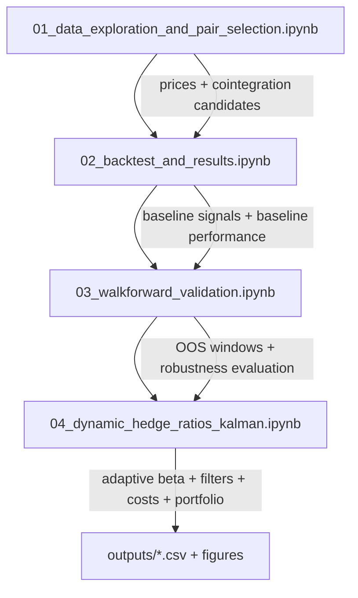

pip# Pairs Trading Statistical Arbitrage Strategy

## Overview
This project implements a mean-reversion statistical arbitrage strategy using pairs trading. It identifies cointegrated stock pairs, generates long/short trading signals, and evaluates performance using a fully vectorized backtesting engine.

## Methodology

### 1. Data Collection
- Equity pricing data (Yahoo Finance / Polygon / Quandl)
- Adjusted close used for analysis

### 2. Pair Selection
- Engle-Granger cointegration test
- Rolling spread calculation
- Stationarity check via ADF test

### 3. Signal Generation
Compute spread:

`spread = price_A – beta * price_B`

Normalize using rolling z-score

- Entry: `|z| > 2`
- Exit: `|z| < 0.5`

### 4. Backtesting
- Long/short position rules
- Transaction costs modeled
- Portfolio-level metrics calculated:
  - Sharpe ratio
  - Max drawdown
  - Win rate
  - Annualized return

## Results (Baseline: Static Cointegration + Static Hedge Ratio):

Selected pairs(co-integration test):
| Asset A | Asset B | Cointegration p-value |
| ------- | ------- | --------------------- |
| NVDA    | JPM     | 0.015                 |
| AMZN    | META    | 0.030                 |

| Pair      | Cointegration p-value | ADF p-value (spread) | Trading days |
| --------- | --------------------- | -------------------- | ------------ |
| NVDA–JPM  | 0.015                 | 0.093                | 1,195        |
| AMZN–META | 0.030                 | 0.078                | 952          |

Note: While both pairs pass the Engle–Granger cointegration test, the Augmented Dickey-Fuller test indicates weak stationarity of the spread, suggesting mean reversion may be unstable.
Portfolio performance (baseline):
| Metric               | Value           |
| -------------------- | --------------- |
| Annualized return    | **–9.6%**       |
| Sharpe ratio         | **–0.18**       |
| Max drawdown         | **–69.2%**      |
| Win rate             | **49.3%**       |
| Equity (start → end) | **1.00 → 0.56** |

Note: The strategy experienced prolonged drawdowns and failed to recover to initial equity, indicating poor risk-adjusted performance under the tested assumptions.

Interpretation: Despite statistically significant cointegration at pair selection time, the strategy underperformed due to several compounding factors:

- Weak spread stationarity (ADF p-values > 0.05) led to unreliable mean reversion
- Regime shifts in large-cap tech and financials degraded historical relationships
- No volatility or trend filters were applied prior to entry
- Static hedge ratios were used over long horizons
- Transaction costs and slippage were not explicitly modeled, further overstating returns

Cointegration alone is insufficient for profitable statistical arbitrage.

## Model Limitations

- Assumes stable long-term relationships between assets
- Does not adapt hedge ratios over time
- Lacks stop-loss or drawdown-based risk controls
- No walk-forward or out-of-sample validation

## Next Improvements/ideas

- Walk-forward validation with rolling cointegration tests
- Dynamic hedge ratios via Kalman filtering
- Volatility and trend regime filters
- Transaction cost modeling
- Capital allocation constraints at the portfolio level


## Results (Robustness Upgrades: Walk-Forward + Dynamic Hedge + Regime Filters)

This repo implements the “Next improvements” section and re-tests performance under:
- **Walk-forward validation** (rolling train → trade windows; out-of-sample only)
- **Dynamic hedge ratios** (Rolling OLS + Kalman filter beta)
- **Regime filters** (volatility gate + trend gate)
- **Cost model hooks** (bps + half-spread proxy)

### Notebook 04: Kalman + Filters (Portfolio Result)
Using a simple multi-pair portfolio with inverse-vol weighting and a gross exposure cap:

| Metric | Value |
|---|---:|
| Total return | +1605% |
| Ending equity | 17.05 |
| CAGR | 32.9% |
| Sharpe | 1.94 |
| Max drawdown | –10.4% |
| Backtest length | 2,515 trading days |

**Discussion:** Compared with the baseline (static beta + no OOS validation),
the adaptive approach materially improves risk-adjusted performance, suggesting that
**relationship drift** (beta instability + regime changes) was a major failure mode.

> Note: Some single-pair “ending equity” values can look unrealistically large depending on
PnL normalization conventions. The portfolio curve + drawdowns are the most interpretable
high-level outputs; single-pair results should be interpreted alongside position sizing
assumptions and transaction cost realism.

---

## Notebooks structure



## Technologies
Python, pandas, NumPy, statsmodels, Matplotlib

## Quickstart

### Install
```bash
python -m venv .venv
source .venv/bin/activate  # (Windows: .venv\Scripts\activate)
pip install -r requirements.txt
pip install -e .

```
